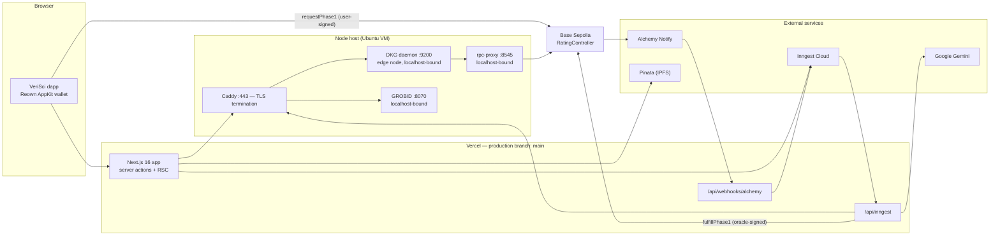
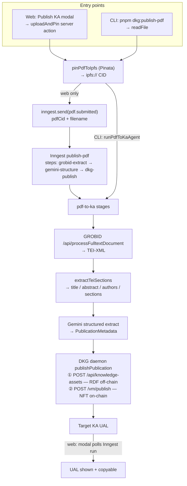

# desci-rating-dapp (VeriSci)

Quality signals for scientific Knowledge Assets on **OriginTrail DKG V10**, anchored on **Base Sepolia**.

Publications are minted as **Target Knowledge Assets (KAs)**. A rating is a **separate** Rating Knowledge Asset (R-KA) linked to the target via `schema:about` — the original KA is never modified. On-chain, `RatingController` is a request/fulfill state machine: anyone may request a rating, only the oracle agent may fulfill it.

> **Status: deployed and running on Base Sepolia testnet.** Both product flows — Publish KA and Rate KA — have been verified end to end in production. See [Live deployment](#live-deployment).

---

## The problem

OriginTrail DKG uses a **Dual Engine** architecture. Every Knowledge Asset has two complementary representations: its RDF assertion triples are stored off-chain across the DKG peer network (queryable via SPARQL), while a corresponding NFT is minted on-chain to anchor ownership and provenance with cryptographic proofs. The on-chain NFT does not contain the data — it is a pointer.

This gives KAs cryptographic guarantees and semantic queryability, but **no quality signal**. Agents traversing the graph to build hypotheses have no way to weight source reliability.

This repo attaches a rating to any KA without modifying it: an independent Rating KA minted with the same Dual Engine architecture, linked to the target via `schema:about`, designed to evolve across three phases (machine score → human review → wet-lab).

---

## Live deployment

Two isolated environments share the node host but nothing else: separate `RatingController` deploys and separate context graphs, so neither can rate a KA the other already rated.

| Resource | Production | Preview / staging |
|---|---|---|
| Dapp | <https://desci-rating-dapp.vercel.app> | Vercel preview URL per branch |
| Git branch | `main` | `develop` and feature branches |
| `RatingController` | [`0x88b467bf29a88b5a7b6d351f74b26a18baf8f373`](https://sepolia.basescan.org/address/0x88b467bf29a88b5a7b6d351f74b26a18baf8f373) | [`0xe83d248193e5cdb0db89ecd113feb1c4d0fe9e96`](https://sepolia.basescan.org/address/0xe83d248193e5cdb0db89ecd113feb1c4d0fe9e96) |
| Context graph | `0x38B548Ca70E61055a936EF84C2Ff65B8cca22DD8/verisci-prod` (registry id `456`) | `0x38B548Ca70E61055a936EF84C2Ff65B8cca22DD8/verisci` (registry id `433`) |
| Alchemy webhook | watches the production contract | watches the develop contract |

The address is not compiled in: it comes from `NEXT_PUBLIC_RATING_CONTROLLER_ADDRESS`, and `packages/contracts/ts/deployments.ts` is only a record of the last deploy.

| Shared resource | Value |
|---|---|
| Chain | Base Sepolia (`84532`) |
| DKG node | `https://verisci-dkg.duckdns.org` — OriginTrail `10.0.16`, `nodeRole: edge`, testnet |
| GROBID | `https://verisci-grobid.duckdns.org` (secret path prefix) |
| Jobs | Inngest Cloud → `POST /api/inngest` |

Token ids are minted by OriginTrail's shared contract, so numbering is global and each environment shows gaps. That is expected, not a symptom.

| Capability | State |
|---|---|
| Publish KA (PDF → Target KA) | Verified in production |
| Rate KA (wallet → oracle → R-KA → on-chain fulfill) | Verified in production |
| Public HTTP API for agents | Not built — see [Roadmap](#roadmap) |
| Payment / rate limiting | Not built — see [Roadmap](#roadmap) |
| Phase 2 (human review), Phase 3 (wet-lab) | Not built |

**Phase-1 scoring** is a Gemini pass (default `gemini-3.5-flash-lite`, `temperature: 0`) over the Target KA's RDF triples, producing a structured `{ score, rationale, observed, missing }` verdict with `score` an integer in `[0, 100]`. The heuristics are intentionally rough — this version proves the pipeline shape (request → score → R-KA → on-chain fulfill), not a calibrated quality signal.

**Payment model V0:** `requestPhase1` is non-payable. It takes no ETH or TRAC beyond the caller's gas. The oracle wallet pays `fulfillPhase1` gas and sponsors the DKG publish off-chain. This is a known abuse surface, addressed in the [Roadmap](#roadmap).

---

## Deployment topology

The app is not one process. Four systems cooperate, and the split is forced by a hard constraint: **a DKG node is a long-lived peer-to-peer daemon, and Vercel runs serverless functions that live for seconds.** The node therefore runs on a dedicated host that the app reaches over HTTPS.



Only Caddy is exposed publicly. The DKG daemon, GROBID, and the RPC proxy all bind to `127.0.0.1`.

---

## Architecture

Two independent flows. A user may publish a KA without requesting a rating, or request a rating on any existing KA UAL.

### Flow 1 — Publish a KA (PDF → Target KA)

Available from the web app (`Publish KA` modal on the landing page) and from the CLI (`pnpm dkg:publish-pdf`). Both run the same three stages — the CLI in one call via `runPdfToKaAgent`, the Inngest job as one step per stage so a retry resumes instead of restarting.



**No wallet is involved.** The DKG daemon's operational wallet signs the KA mint and pays the gas.

**Why GROBID *and* Gemini.** GROBID is a specialised model that converts PDF layout into structured TEI-XML — it recognises title blocks, author affiliations, and reference lists positionally. Gemini then reads that clean XML to extract semantic fields (methods, materials, RRIDs, data repository links). Running an LLM directly on raw PDF text is both worse and more expensive.

**Why a durable job.** GROBID + Gemini + DKG publish routinely exceeds a single HTTP request budget, so the web path enqueues an Inngest job (`finish: "10m"`, 2 retries) and the modal polls run status every 3 s.

`publishAssertion` is **idempotent by KA name**: it short-circuits to the existing UAL when the name already resolves, and recovers from "already exists" / "unfinished promote" responses by re-reading the UAL. Note that this only helps when the caller passes an explicit `name` — the default generated names (`desci-pub-*`) are fresh UUIDs, so **submitting the same PDF twice mints two Target KAs.** Deduplicating on the pinned CID is a [Roadmap](#roadmap) item.

### Flow 2 — Rate a KA (Phase-1 oracle)


**Two wallets sign, and that is the security model.** The user signs the *request*, so `msg.sender` is recorded as the requester. Only `oracleAgent` can sign the *fulfillment* — `fulfillPhase1` is guarded by `onlyOracleAgent`, so scores cannot be forged.

The `phase1-requested` function retries 3 times with concurrency 5 global / 1 per `requestId`. It retries on `TargetAssetNotIndexedError` to absorb DKG indexing lag, and `fulfillPhase1OnChain` reads `getRatingByUal` first, returning `already_fulfilled` without sending a transaction if the record is already `Phase1Completed`. The UI warns after 90 s (`ORACLE_STALL_MS`) if the oracle has not fulfilled.

---

## Repository layout

pnpm workspaces + Turborepo. **pnpm only** (`pnpm@10.24.0`) — never npm or yarn.

```
apps/web                 Next.js 16 dapp — landing, catalog, publish modal, /rate-ka,
                         Alchemy webhook + Inngest serve
packages/agents          pdf-to-ka, ka-scorer, IPFS helpers, Inngest/EVM integrations
packages/dkg-client      DKG V10 daemon client + publication/rating KA builders
packages/contracts       Foundry — RatingController.sol + generated TS ABI/address
packages/env             Typed env catalog (@t3-oss/env-nextjs + Zod)
packages/shared          Chain constants + shared types
```

Conventions:

- Import direction is **app → packages**. Packages never import from `apps/web`.
- Contract ABI and address come from `@desci/contracts` — never hardcode them.
- Chain id comes from `BASE_SEPOLIA_CHAIN_ID` (`84532`) in `@desci/shared`.

Package-level docs:

- [`apps/web/README.md`](apps/web/README.md)
- [`packages/dkg-client/README.md`](packages/dkg-client/README.md)
- [`packages/agents/README.md`](packages/agents/README.md)
- [`packages/agents/src/agents/pdf-to-ka/README.md`](packages/agents/src/agents/pdf-to-ka/README.md)
- [`packages/agents/src/agents/ka-scorer/README.md`](packages/agents/src/agents/ka-scorer/README.md)
- [`packages/agents/src/ipfs/README.md`](packages/agents/src/ipfs/README.md)
- [`packages/agents/src/integrations/README.md`](packages/agents/src/integrations/README.md)
- [`packages/contracts/README.md`](packages/contracts/README.md)

---

## Local development

### Prerequisites

- Node.js + `pnpm@10.24.0`
- OriginTrail DKG CLI (`@origintrail-official/dkg`, in root devDependencies)
- Foundry (`forge`) for contracts
- Docker for GROBID
- Pinata JWT, Google Gemini key, Base Sepolia RPC URL, oracle wallet, Reown project id

### Install

```bash
git clone <this-repo>
cd desci-rating-dapp
pnpm install
cp .env.example .env          # fill in — see Environment
pnpm dkg:init                 # first-time daemon setup (passes --network testnet)
pnpm build
```

### Run the full stack

```bash
pnpm dkg:start      # DKG daemon on 127.0.0.1:9200
pnpm grobid:up      # GROBID container on 127.0.0.1:8070
pnpm dev            # Next.js on :3000
pnpm inngest:dev    # Inngest Dev Server → http://localhost:3000/api/inngest
```

GROBID is ready when `curl -s http://127.0.0.1:8070/api/isalive` returns `true`. The image is `grobid/grobid:0.8.2-crf` (~500 MB, CPU-only); the Compose file uses `network_mode: host` (Linux), so on Docker Desktop replace it with `ports: ["8070:8070"]`.

### The local DKG V10 node

`pnpm dkg:init` (`dkg init --network testnet`) creates `~/.dkg` with `config.json`, the agent key, and the daemon's admin token in `~/.dkg/auth.token`. `@desci/dkg-client` resolves both the port and that token by itself, which is why `DKG_API_URL` and `DKG_AUTH_TOKEN` stay unset locally. Verify with `dkg status` and `curl -s http://127.0.0.1:9200/api/status`.

**The context graph needs no manual creation locally.** Every publish calls `ensureContextGraph` first, which POSTs `/api/context-graph/create` with the id exactly as written, so `DKG_CONTEXT_GRAPH_ID=verisci` is enough. The trap is mixing that with the CLI: **a bare id stays bare over HTTP, while `dkg context-graph create` auto-prefixes your agent address.** If you do create it from the CLI, copy the full `<agent-address>/verisci` it prints into `.env`, or the two paths will disagree about which graph you mean. Full procedure, including on-chain registration: [Creating and registering a context graph](#creating-and-registering-a-context-graph).

**Publishing from a local daemon still spends real Base Sepolia gas.** The node's own wallet pays for the KA mint, and the first publish into an unregistered graph also pays to register it. Fund that wallet, and check it with the daemon's own token:

```bash
curl -s http://127.0.0.1:9200/api/wallets/balances \
  -H "Authorization: Bearer $(cat ~/.dkg/auth.token)" | python3 -m json.tool
```

The default `~/.dkg/config.json` points `chain.rpcUrl` at public Base Sepolia endpoints — exactly what [the RPC proxy section](#2--why-a-local-rpc-proxy-is-required) explains cannot serve authority resolution reliably. A local publish failing with `authority-resolution-failed` is that limit, not a broken graph. Two ways out: run the same proxy locally and point `chain.rpcUrl` at `http://127.0.0.1:8545`, or skip the local daemon and set `DKG_API_URL` / `DKG_AUTH_TOKEN` to the hosted node — in which case `DKG_CONTEXT_GRAPH_ID` must be that node's **full** graph id, and your publishes land in the staging graph rather than a local one.

The landing page probes the daemon once per request (`probeDkgDaemon` → `GET /api/status`, wrapped in React `cache()`). When it is unreachable the catalog and the Publish button degrade to a "DKG connection not available" state instead of erroring.

Alchemy Notify needs a public HTTPS URL. Locally, use `ngrok http 3000` and point the webhook at `https://<host>/api/webhooks/alchemy`, or inject the `RatingController/phase1.requested` event directly from the Inngest Dev Server UI.

### CLI-only workflows

```bash
# Sample Target KA (no PDF, GROBID, or Gemini)
pnpm dkg:publish-sample          # prints a Target KA UAL
# set DKG_UAL and DKG_CONTEXT_GRAPH_ID in .env
pnpm dkg:fetch-asset             # Action A: KA triples  /  Action B: empty

# Real PDF → publication Target KA
pnpm grobid:up
pnpm dkg:publish-pdf packages/agents/fixtures/asx-pub.pdf
```

---

## Production setup

Reproducing the deployment has two halves: a **node host** that runs the long-lived services, and **Vercel** for the app.

### 1 — Node host

An Ubuntu VM with a public IP and two DNS names. Everything except Caddy binds to localhost.

| Unit | Port | Role |
|---|---|---|
| `caddy` | 443 | TLS termination + reverse proxy |
| `dkg.service` | 9200 | OriginTrail edge node |
| GROBID (Docker) | 8070 | PDF → TEI-XML |
| `rpc-proxy.service` | 8545 | JSON-RPC proxy for the DKG node (see below) |

Caddy maps `verisci-dkg.duckdns.org` → `127.0.0.1:9200` and `verisci-grobid.duckdns.org` → `127.0.0.1:8070`. GROBID has no authentication of its own, so it is published under a **secret path prefix** rather than at the domain root.

DKG daemon configuration (`~/.dkg/config.json`):

```json
{
  "nodeRole": "edge",
  "networkConfig": "testnet",
  "contextGraphs": [
    "0x38B548Ca70E61055a936EF84C2Ff65B8cca22DD8/verisci",
    "0x38B548Ca70E61055a936EF84C2Ff65B8cca22DD8/verisci-prod"
  ],
  "chain": { "rpcUrl": "http://127.0.0.1:8545", "rpcUrls": [] }
}
```

One graph per environment: `verisci` (on-chain registry id `433`) backs Preview, `verisci-prod` (id `456`) backs Production. Both must be listed under `contextGraphs` so the node re-subscribes on every restart — a runtime `dkg subscribe` alone does not survive a restart:

```bash
dkg subscribe 0x38B548Ca70E61055a936EF84C2Ff65B8cca22DD8/verisci
```

#### Creating and registering a context graph

Creating and registering are separate, and only registration costs anything.

**1 — Create, subscribe and persist.** Pass a *bare* name: the daemon prefixes your agent address and prints the full id, which is the one every other command and `DKG_CONTEXT_GRAPH_ID` want. `--access-policy 0` (open) is the CLI default and matches what `ensureContextGraph` sends; `--save` writes the subscription into `config.json`.

```bash
dkg context-graph create verisci-prod --access-policy 0 --save
```

The graph exists on the node within seconds, but the command then **blocks for ten minutes or more** fanning shared-memory sync out to every peer, and `--save` only lands when it returns. Check `dkg context-graph list` from a second shell rather than waiting; if you interrupt the client, add the id to `contextGraphs` by hand.

**2 — Register on chain.** Create is free and local-only — the graph reports `policySource: owner-signed-unregistered` until registered. `vm/publish` auto-registers on first publish, but doing it up front keeps that gas out of a publish that already runs close to the Vercel invocation ceiling. It takes seconds and prints the registry id:

```bash
dkg context-graph register 0x38B548Ca70E61055a936EF84C2Ff65B8cca22DD8/verisci-prod
```

Pass no policy flags: the defaults (`accessPolicy 0`, `publishPolicy 1`) are what the existing graphs use.

For a few minutes afterwards the daemon logs `RFC-64 authority bootstrap incomplete … execution reverted: ERC721NonexistentToken` and the graph shows `authorityState = blocked`, `stableReason = authority-resolution-failed`. That is the finalized-chain read not yet seeing the fresh token, **not** a bad registration, and it clears itself — `verisci-prod` reached `policySource = finalized-chain` about twenty minutes after registering. Recreating the graph at that point would only waste another registration.

Two red herrings seen while doing this, both harmless: `dkg status` printing `Store … UNREACHABLE` (oxigraph answers `200` when probed directly; the CLI's probe just times out behind a busy store scheduler), and `dkg context-graph catchup-status` reporting a failed job (the staging graph's has been failed since the day it was created and it publishes fine).

### 2 — Why a local RPC proxy is required

This is the least obvious part of the setup, so it is worth stating plainly.

Before an edge node accepts a write into a context graph, it must resolve that graph's **access and publish policy from chain state**. That read (`getContextGraphAuthoritySnapshot`) issues paginated `eth_getLogs` over a large block range plus a number of `eth_call`s. If it fails, the node reports:

```
authorityState = blocked
stableReason   = authority-resolution-failed
```

and refuses every write with `Context graph "…" is known but is not locally synced for writes`. **A blockchain read limit therefore surfaces as an unexplained publish failure.**

Free RPC tiers cannot serve that read directly:

| Provider | `eth_getLogs` behaviour |
|---|---|
| Alchemy free | Hard 10-block range cap |
| Public Base Sepolia endpoints | Accept ~2000-block windows, throttle bursts aggressively |

The DKG daemon accepts exactly **one** `rpcUrl`, so the fix is a small JSON-RPC proxy on `127.0.0.1:8545` that the daemon treats as an ordinary node. It routes bulk `eth_getLogs` to public endpoints and everything else to Alchemy, with per-endpoint concurrency limits, throttle-aware backoff, and cross-provider failover.

Three properties are load-bearing, each learned from a failure:

1. **Always return well-formed JSON-RPC.** A bare `{"error":{...}}` without `id` and `jsonrpc` makes the daemon fail with `BAD_DATA`, which masks the real cause.
2. **Cache the chain head.** Deriving the tip per `getLogs` call generates tens of thousands of redundant `eth_blockNumber` requests and exhausts the provider quota.
3. **Keep latency-sensitive calls out of the bulk queue.** The daemon enforces a **4-second deadline** on its head probe. If cheap calls queue behind the historical backfill, authority resolution times out even though every individual request succeeds.

Order the units so the proxy is up before the daemon, otherwise a reboot reproduces the original failure:

```ini
# /etc/systemd/system/dkg.service.d/10-after-rpc-proxy.conf
[Unit]
After=rpc-proxy.service
Wants=rpc-proxy.service
```

Health check:

```bash
systemctl is-active rpc-proxy dkg

curl -s http://127.0.0.1:9200/api/status | python3 -c "
import json,sys; d=json.load(sys.stdin)
for g in (d.get('rfc64Catalog') or {}).get('contextGraphs') or []:
    print(g.get('contextGraphId') or g.get('id'))
    for k in ['phase','authorityState','accessPolicy','publishPolicy','stableReason']:
        print(' ',k,'=',g.get(k))
"
```

Every subscribed graph is reported, because authority resolution is per-graph: one healthy graph says nothing about the others.

Two graphs now backfill through the single proxy, so `authority-resolution-failed` has two very different causes. Read the daemon log before touching the proxy: `ERC721NonexistentToken` is the post-registration finality lag described above and clears itself, while a head-probe timeout is genuine queue contention against the 4-second deadline.

`accessPolicy` is the field that matters: once it holds a value, writes are accepted. A `stableReason` of `catalog-replay-incomplete` on an empty graph is expected and does **not** block writes.

#### Verifying both graphs are set up and running

`/api/status` is unauthenticated through Caddy, so the check that matters needs no SSH — run it from anywhere, or against `http://127.0.0.1:9200` for a local daemon:

```bash
curl -s https://verisci-dkg.duckdns.org/api/status | python3 -c "
import json,sys; d=json.load(sys.stdin)
for g in (d.get('rfc64Catalog') or {}).get('contextGraphs') or []:
    print(g.get('contextGraphId') or g.get('id'))
    for k in ['phase','authorityState','policySource','accessPolicy','publishPolicy','stableReason']:
        print(' ',k,'=',g.get(k))
"
```

A graph is ready for writes when it reports `policySource = finalized-chain`, `accessPolicy = 0`, `publishPolicy = 1` and `stableReason = None`. `policySource = owner-signed-unregistered` means it exists but was never registered on chain; `authorityState = blocked` means writes are refused. `phase = resolving-authority` is normal — the working graph sits there too, because the daemon re-resolves periodically.

Three further checks on the node itself, in order of usefulness:

```bash
systemctl is-active rpc-proxy dkg   # the proxy must be up, or nothing resolves
dkg context-graph list              # both ids present, Type "user"
python3 -c "import json;print(json.load(open('/home/ubuntu/.dkg/config.json'))['contextGraphs'])"
```

That last one is the one people forget: a graph missing from `contextGraphs` works until the next restart and then silently stops being subscribed.

### 3 — Vercel

Set the project **Root Directory** to `apps/web` with "include files outside this directory" enabled, Framework Preset **Next.js**, and leave **Output Directory** empty. [`apps/web/vercel.json`](apps/web/vercel.json) installs from the repo root and builds with `pnpm turbo run build --filter=web`.

Production branch is `main`. Scope these to **Preview as well as Production** — the build validates the catalog, so a Preview deployment missing them fails instead of rendering an empty catalog:

- `DKG_API_URL` + `DKG_AUTH_TOKEN` pointing at the hosted node
- `GROBID_URL` including the secret path prefix
- `GOOGLE_API_KEY`, `PINATA_JWT`, `IPFS_GATEWAY_URL`
- `BASE_SEPOLIA_RPC_URL`, `ORACLE_AGENT_PRIVATE_KEY`
- `INNGEST_EVENT_KEY`, `INNGEST_SIGNING_KEY`
- `NEXT_PUBLIC_APP_URL` set to the deployed origin, and `NEXT_PUBLIC_REOWN_PROJECT_ID`

Three more **differ per environment**, and getting one wrong is what makes the two deployments interfere:

| Variable | Production | Preview |
|---|---|---|
| `NEXT_PUBLIC_RATING_CONTROLLER_ADDRESS` | `0x88b467bf29a88b5a7b6d351f74b26a18baf8f373` | `0xe83d248193e5cdb0db89ecd113feb1c4d0fe9e96` |
| `DKG_CONTEXT_GRAPH_ID` | `0x38B548Ca70E61055a936EF84C2Ff65B8cca22DD8/verisci-prod` | `0x38B548Ca70E61055a936EF84C2Ff65B8cca22DD8/verisci` |
| `ALCHEMY_BASE_SEPOLIA_WH_SK` | signing secret of the webhook watching `0x88b4…f373` | signing secret of the webhook watching `0xe83d…9e96` |

Both must be set locally too: the repo-root `.env` holds the Preview pair, because `ts/deployments.ts` records the **last deploy** (production) rather than the runtime address.

Why each knob is needed rather than just the contract: `getRequestId` is `keccak256(targetUal)`, so the same UAL keys the same storage slot in both contracts, but each contract has its own separate storage for it. Sharing one graph across two contracts would let the same KA be rated once per environment, render the paper twice in the catalog, and leave each environment contradicting the other about whether it is rated.

Case does not matter in the address: the webhook route and every read run it through viem's `getAddress` first.

`@desci/contracts` builds with `tsc` over the committed `ts/` ABI files, because Foundry is not available on Vercel. After Solidity changes, regenerate locally with `pnpm contracts:build` and commit `packages/contracts/ts/`.

### 4 — Wire the external services

- **Inngest Cloud** — sync the app so `/api/inngest` registers all five functions.
- **Alchemy Notify** — **one webhook per environment**, each watching that environment's `RatingController` and POSTing to that deployment's `/api/webhooks/alchemy`. Both can stay enabled permanently: the route skips logs from any other address, and each webhook has its own signing secret, so a POST reaching the wrong deployment fails HMAC verification and returns `401` rather than starting a second oracle. Repeated 401s in the Vercel logs are the signature of a swapped secret.
- **Reown** — add the deployed origin to Allowed Origins in [Reown Cloud](https://dashboard.reown.com), matching `NEXT_PUBLIC_APP_URL`.

---

## Environment

All secrets live in repo-root `.env`. Reference: [`.env.example`](.env.example). `apps/web/next.config.ts` merges that file into `process.env` at config load (existing process env wins) — do not create `apps/web/.env.local` as a second source of truth. **Never commit `.env`.**

`@desci/env` validates with `@t3-oss/env-nextjs`, and variables are **required by default**: a missing or malformed value throws the moment the catalog is imported. `apps/web/next.config.ts` imports both entries, so `next build` fails up front rather than serving a half-configured app. A variable is only optional when there is a real fallback — a Zod `.default()`, or a `~/.dkg` lookup — and the table below names that fallback.

`PRIVATE_KEY`, `ORACLE_AGENT`, and `ETHERSCAN_API_KEY` are Foundry-only. They stay in `.env` / `.env.example` but are deliberately absent from `@desci/env` so the app cannot read a deployer key. `INNGEST_EVENT_KEY` is likewise absent — the Inngest SDK reads it from `process.env` itself.

| Variable | Required? | Purpose |
|---|---|---|
| `DKG_CONTEXT_GRAPH_ID` | yes | Context graph the Inngest workers write to and the web catalog reads. **Differs per environment** — see [Vercel](#3--vercel) |
| `DKG_API_URL` / `DKG_AUTH_TOKEN` | no | Daemon endpoint and bearer token. Omit locally to resolve from `~/.dkg` |
| `DKG_API_PORT` / `DKG_HOME` | no | Default `9200` and `~/.dkg` |
| `DKG_KA_NAME` / `DKG_UAL` / `DKG_SUBJECT_URI` / `DKG_PDF_PATH` | no | CLI script arguments; each also accepts argv |
| `GROBID_URL` | no | Default `http://127.0.0.1:8070`; in production, includes the secret path prefix |
| `GROBID_TIMEOUT_MS` | no | Default `120000` |
| `PINATA_JWT` | yes | Pins PDFs for `pnpm dkg:publish-pdf` and the web Publish KA flow |
| `IPFS_GATEWAY_URL` | no | Defaults to the Pinata public gateway |
| `GOOGLE_API_KEY` | yes | `pdf-to-ka` + `ka-scorer` |
| `GEMINI_MODEL` | no | Default `gemini-3.5-flash-lite` |
| `BASE_SEPOLIA_RPC_URL` | yes | `fulfillPhase1` and all server-side contract reads |
| `ORACLE_AGENT_PRIVATE_KEY` | yes | Viem signer for `fulfillPhase1` — must match on-chain `oracleAgent()`. Not the deployer key. Validated as 32-byte hex and normalised to `0x`-prefixed |
| `ALCHEMY_BASE_SEPOLIA_WH_SK` | yes | HMAC secret for `/api/webhooks/alchemy`. **Differs per environment** — one webhook per contract, each with its own secret |
| `INNGEST_SIGNING_KEY` | no | Inngest Cloud only; the local Dev Server needs none |
| `INNGEST_API_BASE_URL` | no | REST base for publish-status polling. Defaults to `http://localhost:8288` in dev, `https://api.inngest.com` in production |
| `INNGEST_ENV` | no | Inngest environment the publish-status poll reads. Derived from `VERCEL_GIT_COMMIT_REF` when unset, matching what the SDK sends |
| `NEXT_PUBLIC_APP_URL` | yes | Reown AppKit `metadata.url`; must match the deployed origin |
| `NEXT_PUBLIC_RATING_CONTROLLER_ADDRESS` | yes | The `RatingController` every read and write targets, resolved by `getRatingControllerAddress` in `@desci/contracts`. **Differs per environment.** `NEXT_PUBLIC_` because two call sites are client components. Required with no fallback on purpose: an optional value would let a misconfigured deployment silently talk to whichever contract was deployed last |
| `NEXT_PUBLIC_REOWN_PROJECT_ID` | no | Reown AppKit. Without it the app builds and renders, but wallet connect is disabled |
| `NEXT_PUBLIC_CONTACT_PORTFOLIO_URL` / `NEXT_PUBLIC_CONTACT_LINKEDIN_URL` | no | Footer links; omit either to hide it |
| `PRIVATE_KEY` | — | Foundry deployer / contract owner. **Not in `@desci/env`** — local deploy only, never Vercel |
| `ORACLE_AGENT` | — | Public address of the oracle, written to `oracleAgent` at deploy. **Not in `@desci/env`** — Foundry `HelperConfig` only |
| `ETHERSCAN_API_KEY` | — | `forge script --verify`. **Not in `@desci/env`** — Foundry only |
| `INNGEST_EVENT_KEY` | — | Inngest Cloud. **Not in `@desci/env`** — read by the SDK from `process.env` |

`STITCH_API_KEY` appears in `.env.example` for the Google Stitch MCP server, which reads it from the OS environment — it is not read from `.env` and not used by the app.

---

## Root scripts

| Script | Purpose |
|---|---|
| `pnpm build` / `dev` / `test` / `clean` | Turborepo. `test` currently resolves to the Foundry suite only |
| `pnpm dkg:init` / `dkg:start` / `dkg:stop` | Local DKG daemon lifecycle |
| `pnpm dkg:publish-sample` | Publish a sample Target KA |
| `pnpm dkg:fetch-asset` | Print KA quads + ratings for a UAL |
| `pnpm dkg:publish-pdf [path]` | Pin → GROBID → Gemini → Target KA |
| `pnpm grobid:up` / `grobid:down` | GROBID Docker sidecar |
| `pnpm inngest:dev` | Inngest Dev Server |
| `pnpm contracts:build` | `forge build` + ABI export + `tsc` |
| `pnpm contracts:test` / `test:vv` / `test:gas` / `coverage` | Foundry |
| `pnpm contracts:deploy:base-sepolia` | Sources repo-root `.env`, then broadcast + verify |

---

## Packages

### `@desci/dkg-client`

`createDkgClient()` connects to the daemon and exposes `ensureContextGraph`, `publishAsset`, `getAssetUal`, `publishPublication`, `publishRating`, `query`, `getAssetQuadsByUal`, `queryRatingsAbout`, `getChainId`, `getHubAddress`, `getApiBaseUrl`, and `stop()` (a no-op — daemon lifecycle is external). Also exports `probeDkgDaemon` for cheap liveness checks, `queryPublicationsWithRatings` for the catalog, the KA graph builders, `parseUal` / `ualFromVerifiableMemoryGraphIri` for asset identity, `literalLexicalForm` for reading query results, and the vocab IRIs.

Auth and API URL resolve from `createDkgClient({ apiUrl, authToken })` or env / `~/.dkg`: `DKG_AUTH_TOKEN` or `~/.dkg/auth.token`; `DKG_API_URL`, else `~/.dkg/api.port`, else `config.json` `apiPort`, else `DKG_API_PORT` (default `9200`).

R-KA quads: `schema:about`, `schema:ratingValue`, `schema:author`, `schema:description` (the scorer's rationale), plus one repeated `desci:observedEvidence` / `desci:missingEvidence` literal per rigor signal. `queryRatingsAbout` returns those as `observed` / `missing` arrays, and falls back to parsing the old single-blob description for R-KAs minted before those terms existed. Publication graphs use schema.org plus DEO section types. `getAssetQuadsByUal` throws `TargetAssetNotIndexedError` on an empty result, which the Inngest function retries to absorb indexing lag.

### `@desci/agents`

| Export | Role |
|---|---|
| `runPdfToKaAgent` | GROBID + Gemini metadata + `publishPublication` |
| `runKaScorerAgent` | Target KA RDF → `{ score, rationale, observed, missing }` |
| `@desci/agents/ipfs` | `pinPdfToIpfs` / `fetchPdfByCid` / `ipfsUriForCid` / `bareCid` |
| `@desci/agents/inngest` | Inngest client, event schemas, Alchemy log adapter, and 5 functions |

LLM: LangChain `ChatGoogleGenerativeAI` + Zod structured output. No LangGraph.

`ka-scorer` ignores PDF pin metadata (`schema:encoding`, `contentUrl`, `encodingFormat`, `MediaObject`) — dropped in code before the prompt and restated in the prompt. It rewards author-side `schema:distribution` links and methods/materials / RRID evidence. Named statistical tests are not treated as validated results (MVP heuristic).

### `@desci/contracts`

`RatingController.sol` (Solidity `0.8.24`, `UNLICENSED`).

`RatingRecord` fields: `phase`, `isPending`, `phase1Score`, `phase2Score`, `phase3Score`, `rKaUal`. The `Phase` enum has four values (`Unrated`, `Phase1Completed`, `Phase2Completed`, `Phase3Completed`) but only Phase 1 has `request`/`fulfill` functions. `requestId = keccak256(abi.encodePacked(targetUal))`.

`forge build` runs `scripts/export-abi.mjs`, which writes `ts/ratingControllerAbi.ts` and `ts/deployments.ts` from the Forge artifact and the Base Sepolia broadcast file. Do not edit these by hand.

The address consumers import comes from hand-written `ts/address.ts`, which the generator cannot clobber: `getRatingControllerAddress` keeps the chain-id guard but returns `NEXT_PUBLIC_RATING_CONTROLLER_ADDRESS`. The generated address is a deploy record only, so regenerating it after a deploy never changes what a running environment talks to.

### `@desci/env` / `@desci/shared`

`@desci/env`: fail-fast typed env via `@t3-oss/env-nextjs`, split into a server entry (`@desci/env`) and a client entry (`@desci/env/client`, `NEXT_PUBLIC_*` only) so server variable names never reach the browser bundle.

`@desci/shared`: `BASE_SEPOLIA_CHAIN_ID` (`84532`), the DKG hub address, the `RATING_PHASE` enum mirroring Solidity, and shared quad/publish types.

---

## Roadmap

### 1 — Machine-payable access (next)

Both flows are currently free and unauthenticated, so anyone who can reach the app can spend the project's Pinata, Gemini, DKG, and oracle-gas budget. The fix differs per flow, because **the two flows have different entry points**.

**Publish — HTTP API + x402.** The entry point is the server, so every cost sits behind the HTTP boundary and can be gated there.

- Extract a transport-agnostic core (`submitPdfForPublishing`) from the `uploadAndPin` server action, keeping PDF validation inside the core so both callers enforce it.
- Add `POST /api/v1/publish` returning `202 { jobId, statusUrl }`, plus a free `GET /api/v1/publish/{jobId}`.
- Gate the POST with **x402** using `withX402` from `@x402/next`, which settles payment only after a successful response, rather than `paymentProxy`, which charges even when the handler fails.
- Dedupe on the pinned CID so a retry of the same paper is not billed twice.

**Rate — payable on-chain, not x402.** `requestPhase1` is `external` and non-payable with no access control, and the oracle is triggered by Alchemy watching chain events. An agent can therefore bypass any HTTP endpoint entirely and call the contract directly, so **an x402 route would gate nothing**. The toll has to live in the contract:

- Make `requestPhase1` payable with an owner-settable `requestFee`, sized to cover `fulfillPhase1` gas + the Gemini call + the DKG publish.
- Store `address requester` on `RatingRecord` — it is currently only emitted in the event, so no refund is possible. It packs into the existing slot: `Phase`(1) + `bool`(1) + three `uint8`(3) = 5 bytes, leaving room for a 20-byte address.
- Add a requester-callable timeout cancel that refunds the fee. Today only `owner` or `oracleAgent` can call `cancelPendingRequest`, so a stalled oracle would strand user funds.
- Prefer ETH via `msg.value` over USDC: no approve step, and the caller already holds ETH for gas.

Note that on Base Sepolia neither mechanism actually throttles anyone, since both testnet ETH and testnet USDC are free from faucets. Both are demonstrations of the mechanism; real abuse protection begins on mainnet.

### 2 — Operational hardening

- Replace `console.log` with structured logging and alerting on the webhook and Inngest functions.
- Add tests beyond Foundry — `@desci/agents`, `@desci/dkg-client`, and `apps/web` currently have none.
- Move `RatingController` ownership off a single EOA; `setOracleAgent` and `cancelPendingRequest` are guarded only by `owner`.

### 3 — Phase 2: `requestPhase2` (human review)

Eligible only when `phase == Phase1Completed` and not already pending.

- **`RatingController`**: add `requestPhase2` / `fulfillPhase2`. Fulfill stores `phase2Score`, sets `Phase2Completed`, clears pending, and writes a `wetLabRecommended` boolean that gates Phase 3.
- **`ReviewerPool`** (new contract, owned by `RatingController`): enroll/stake, Chainlink VRF cohort draw, optional disjoint redraw on no consensus.
- **Off-chain**: HITL oracle flow triggered by the Phase-2 request event; oracle calls `fulfillPhase2`. `update()` the existing R-KA UAL — no new NFT.

### 4 — Phase 3: `requestPhase3` (wet-lab)

Eligible only when `phase == Phase2Completed` and `wetLabRecommended == true`.

- **`RatingController`**: add `requestPhase3` / `fulfillPhase3`. Fulfill stores `phase3Score`, sets `Phase3Completed`, clears pending.
- **Off-chain**: wet-lab oracle flow triggered by the Phase-3 request event; oracle calls `fulfillPhase3`. `update()` the same R-KA UAL.

R-KA lifetime: mint once in Phase 1 (`rKaUal` stored on-chain); Phases 2 and 3 `update()` that same asset.

---

## Known limitations

- **No authentication or rate limiting.** The `uploadAndPin` server action validates only PDF type and a 5 MB cap. Addressed by Roadmap item 1.
- **Single-chain.** Only Base Sepolia (`84532`) is in `RATING_CONTROLLER_ADDRESSES`, which is what `getRatingControllerAddress` guards against; it throws for any other chain id even though the address itself comes from the environment.
- **Oracle is a single point of failure.** One key signs every `fulfillPhase1`. If it stalls, requests stay `isPending` until `owner` or `oracleAgent` cancels them.
- **Scoring is not calibrated.** Phase-1 heuristics are deliberately rough pending a labelled dataset.
- **Single DKG node.** The app depends on one edge node; there is no failover.
- **Test coverage is Foundry-only.**

---

## Open questions

- Proxy upgradeability vs an immutable `ratings` mapping — V0 ships immutable.
- Composite scoring weights across phases — deliberately unspecified until a labelled dataset exists.
- Citation-triggered re-score via `cito:cites` SPARQL — not in V0.

---

## License

MIT — see [`LICENSE`](LICENSE). `RatingController.sol` is `UNLICENSED` in-source.
