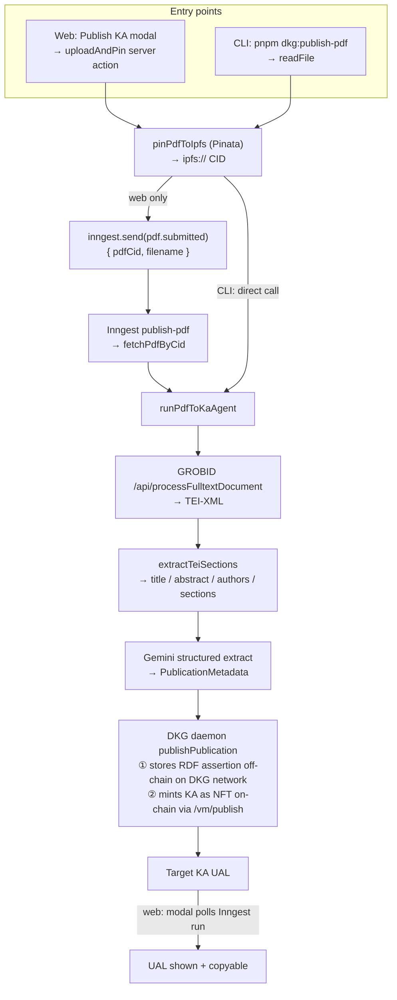
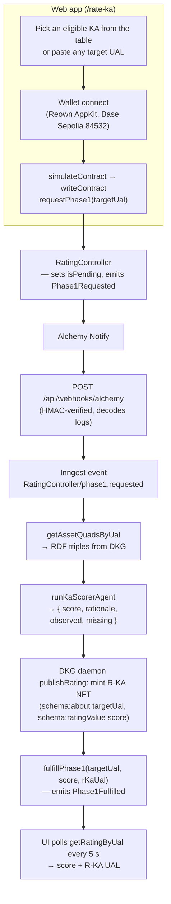

# desci-rating-dapp (VeriSci)

A pipeline to mint **Rating Knowledge Assets (R-KAs)** for scientific publications on OriginTrail DKG V10.

Publications are minted as **Target Knowledge Assets (KAs)** via a local DKG daemon. A rating is a **separate** R-KA linked to the target KA via `schema:about` — the original KA is never touched. On-chain, `RatingController` is a request/fulfill state machine: anyone may request, only the oracle agent may fulfill.

> **Status: local development only. This is not deployed and not production-ready.**
> Both product flows depend on services that only exist on the developer's machine — a DKG daemon on `127.0.0.1:9200`, a GROBID container on `127.0.0.1:8070`, and the Inngest Dev Server on `localhost:8288`. Alchemy webhooks reach the app through an ad-hoc tunnel. See [Why it is not production-ready](#why-it-is-not-production-ready).

**What works today (locally):** the VeriSci Next.js app (landing, KA catalog, PDF → KA publish modal, `/rate-ka` with wallet-signed `requestPhase1`), the publication ingest CLI, R-KA mint, `RatingController` Phase 1 deployed on Base Sepolia, and the Alchemy webhook → Inngest oracle worker.

**What does not exist yet:** Phase 2 (human review), Phase 3 (wet-lab), and any hosted deployment.

---

## The problem

OriginTrail DKG uses a **Dual Engine** architecture: every Knowledge Asset has two complementary representations — its RDF assertion triples are stored off-chain across the DKG peer network (queryable via SPARQL), while a corresponding NFT is minted on-chain (here, Base Sepolia) to anchor ownership and provenance with cryptographic proofs. The on-chain NFT does not contain the data; it is a pointer. This gives KAs cryptographic guarantees and semantic queryability, but no quality signal. Agents traversing the graph to build hypotheses have no way to weight source reliability.

This repo builds the infrastructure to attach a rating to any KA without modifying it: an independent Rating KA minted using the same Dual Engine architecture (RDF triples off-chain on the DKG network, NFT pointer on-chain), linked to the target via `schema:about` and evolving across three phases (machine score → human review → wet-lab).

---

## Current state

| Component | Status |
|---|---|
| DKG V10 daemon HTTP client (`@desci/dkg-client`) | ✅ |
| PDF → GROBID → Gemini → Target KA (CLI + Inngest job) | ✅ |
| R-KA mint + SPARQL query ratings by UAL | ✅ |
| `RatingController` Phase 1 on Base Sepolia | ✅ Deployed |
| Alchemy webhook → Inngest → score → R-KA → `fulfillPhase1` | ✅ (needs a public tunnel for Alchemy) |
| Next.js dapp: landing, KA catalog, PDF upload, wallet `requestPhase1` | ✅ (local dev server) |
| Hosted / production deployment | ❌ |
| Phase 2 — HITL / `ReviewerPool` | ❌ |
| Phase 3 — wet-lab | ❌ |

**Phase-1 scoring** is a Gemini pass (default `gemini-3.5-flash-lite`, `temperature: 0`) over the Target KA's RDF triples, producing a structured `{ score, rationale, observed, missing }` verdict with `score` an integer in `[0, 100]`. The scoring heuristics are intentionally rough — the goal of this version was to prove the pipeline shape (request → score → R-KA → on-chain fulfill), not to produce a calibrated quality signal.

**Payment model V0:** `requestPhase1` is non-payable — it takes no ETH or TRAC beyond the caller's gas. The oracle wallet pays the `fulfillPhase1` gas and sponsors the DKG publish off-chain.

### Deployed contract (Base Sepolia)

[`0xe83d248193e5cdb0db89ecd113feb1c4d0fe9e96`](https://sepolia.basescan.org/address/0xe83d248193e5cdb0db89ecd113feb1c4d0fe9e96)

Alchemy Notify must watch this address. `ORACLE_AGENT` / `ORACLE_AGENT_PRIVATE_KEY` must match `oracleAgent()` on this deploy. The TS ABI and address are generated by `@desci/contracts` — do not hardcode them.

---

## Architecture

Two independent flows. A user may publish a KA without requesting a rating, or request a rating on any existing KA UAL.

### Flow 1 — Publish a KA (PDF → Target KA)

Available both from the web app (`Publish KA` modal on the landing page) and from the CLI (`pnpm dkg:publish-pdf`). Both converge on `runPdfToKaAgent`.



The web modal enforces a 5 MB PDF limit and polls the Inngest REST API every 3 s for run status. GROBID + Gemini + DKG publish can exceed a single HTTP timeout, which is why the web path is a durable Inngest job (`finish: "10m"`) rather than an inline server action.

### Flow 2 — Rate a KA (Phase-1 oracle)



The Inngest `phase1-requested` function retries 3 times with concurrency 5 global / 1 per `requestId`. It retries on `TargetAssetNotIndexedError` to absorb DKG indexing lag, and `fulfillPhase1OnChain` returns `already_fulfilled` without sending a tx if the record is already `Phase1Completed`. The UI shows a warning after 90 s (`ORACLE_STALL_MS`) if the oracle has not fulfilled.

---

## Repository layout

pnpm workspaces + Turborepo.

```
apps/web                 Next.js 16 dapp — landing, catalog, publish modal, /rate-ka,
                         Alchemy webhook + Inngest serve
packages/agents          pdf-to-ka, ka-scorer, IPFS helpers, Inngest/EVM integrations
packages/dkg-client      DKG V10 daemon client + publication/rating KA builders
packages/contracts       Foundry — RatingController.sol + generated TS ABI/address
packages/env             Typed env catalog (@t3-oss/env-core + Zod)
packages/shared          Chain constants + shared types
```

Package-level docs:

- [`apps/web/README.md`](apps/web/README.md)
- [`packages/dkg-client/README.md`](packages/dkg-client/README.md)
- [`packages/agents/README.md`](packages/agents/README.md)
- [`packages/agents/src/agents/pdf-to-ka/README.md`](packages/agents/src/agents/pdf-to-ka/README.md)
- [`packages/agents/src/agents/ka-scorer/README.md`](packages/agents/src/agents/ka-scorer/README.md)
- [`packages/agents/src/ipfs/README.md`](packages/agents/src/ipfs/README.md)
- [`packages/agents/src/integrations/README.md`](packages/agents/src/integrations/README.md)
- [`packages/contracts/README.md`](packages/contracts/README.md)

---

## Prerequisites

- Node.js + `pnpm@10.24.0`
- OriginTrail DKG CLI (`@origintrail-official/dkg` in root devDeps — `pnpm dkg:start`)
- Foundry (`forge`) for contracts
- Docker for GROBID
- Pinata JWT — PDF pin (pin-only; the KA stores `ipfs://…`)
- Google Gemini key — `pdf-to-ka` extract + `ka-scorer`
- Base Sepolia RPC + oracle wallet — `fulfillPhase1`, deploy, and all server-side on-chain reads
- Reown AppKit project id — wallet connect in the web app

The DKG daemon and GROBID run locally. Everything else is an external API.

---

## Setup

```bash
git clone <this-repo>
cd desci-rating-dapp
pnpm install
cp .env.example .env
# fill in .env — see Environment
pnpm dkg:init                     # first-time daemon setup only (already passes --network testnet)
pnpm build
```

---

## Environment

All secrets live in repo-root `.env`. Reference: [`.env.example`](.env.example).

`apps/web/next.config.ts` merges the repo-root `.env` into `process.env` at config load (existing process env wins) — do not create `apps/web/.env.local` as a second source of truth.

Every variable is declared **optional** in `@desci/env` so builds never fail on a missing key; feature boundaries call `requireEnv` / `requireDkgContextGraphId` and throw at use time instead.

| Variable | Purpose |
|---|---|
| `DKG_CONTEXT_GRAPH_ID` | Context graph (default `verisci`). Required by the Inngest workers and the web catalog |
| `DKG_API_URL` / `DKG_API_PORT` / `DKG_AUTH_TOKEN` / `DKG_HOME` | Daemon overrides. Defaults resolve from `~/.dkg` and port `9200` |
| `DKG_KA_NAME` / `DKG_UAL` / `DKG_SUBJECT_URI` / `DKG_PDF_PATH` | CLI script overrides |
| `GROBID_URL` | Default `http://127.0.0.1:8070` |
| `GROBID_TIMEOUT_MS` | Optional; default `120000` |
| `PINATA_JWT` | Required for `pnpm dkg:publish-pdf` and the web Publish KA flow |
| `IPFS_GATEWAY_URL` | Optional; defaults to `https://gateway.pinata.cloud/ipfs` |
| `GOOGLE_API_KEY` or `GEMINI_API_KEY` | `pdf-to-ka` + `ka-scorer` (`GOOGLE_API_KEY` wins) |
| `GEMINI_MODEL` | Optional; default `gemini-3.5-flash-lite` |
| `BASE_SEPOLIA_RPC_URL` | Deploy, `fulfillPhase1`, and all server-side contract reads |
| `PRIVATE_KEY` | Foundry deployer / contract owner |
| `ORACLE_AGENT` | Public address of the oracle, written to `oracleAgent` at deploy |
| `ORACLE_AGENT_PRIVATE_KEY` | Viem signer for `fulfillPhase1` — must match on-chain `oracleAgent()`. Not the deployer key |
| `ETHERSCAN_API_KEY` | `forge script --verify` |
| `ALCHEMY_BASE_SEPOLIA_WH_SK` | HMAC secret for `/api/webhooks/alchemy`; the route returns 500 without it |
| `INNGEST_EVENT_KEY` / `INNGEST_SIGNING_KEY` | Cloud Inngest only; not needed for the local Dev Server |
| `INNGEST_API_BASE_URL` | Optional REST base for publish-status polling. Defaults to `http://localhost:8288` in dev, `https://api.inngest.com` in production |
| `DEV_SKIP_DKG_MINT` | Dev escape hatch. When `"true"`, the oracle scores normally but skips the DKG R-KA write and returns a synthetic UAL so `fulfillPhase1` can still complete |
| `NEXT_PUBLIC_REOWN_PROJECT_ID` | Reown AppKit. Optional — without it the app builds and renders, but wallet connect is disabled |
| `NEXT_PUBLIC_CONTACT_PORTFOLIO_URL` / `NEXT_PUBLIC_CONTACT_LINKEDIN_URL` | Optional footer links |

`STITCH_API_KEY` appears in `.env.example` for the Google Stitch MCP server, which reads it from the OS environment — it is not read from `.env` and not used by the app.

Never commit `.env`.

---

## Local workflows

### 1 — Sample KA + mock R-KA (no external services)

```bash
pnpm dkg:start
pnpm dkg:publish-sample          # prints a Target KA UAL
# set DKG_UAL and DKG_CONTEXT_GRAPH_ID in .env
pnpm dkg:fetch-asset             # Action A: KA triples  /  Action B: empty (no rating yet)
pnpm dkg:publish-rating          # mock R-KA, score=85, author=BioProtocol_Phase1_Agent
pnpm dkg:fetch-asset             # Action B now shows the rating
```

Publishing is idempotent **by KA name** — if the named KA already exists its UAL is returned instead of republishing.

### 2 — PDF → publication Target KA (CLI)

```bash
# Requires: GOOGLE_API_KEY, PINATA_JWT, DKG_CONTEXT_GRAPH_ID
pnpm dkg:start
pnpm grobid:up
# wait: curl -s http://127.0.0.1:8070/api/isalive → true
pnpm dkg:publish-pdf packages/agents/fixtures/asx-pub.pdf
```

Flow: `readFile` → `pinPdfToIpfs` → `runPdfToKaAgent` (GROBID → TEI → Gemini → DKG publish).

GROBID image: `grobid/grobid:0.8.2-crf` (~500 MB, CPU-only). The Compose file uses `network_mode: host` (Linux); on Docker Desktop replace it with `ports: ["8070:8070"]`.

Output: a Target KA UAL with `schema:encoding` / `schema:contentUrl` set to `ipfs://…`.

### 3 — Full app: web dapp + Phase-1 oracle

```bash
# Requires: DKG_CONTEXT_GRAPH_ID, GOOGLE_API_KEY, PINATA_JWT,
#           BASE_SEPOLIA_RPC_URL, ORACLE_AGENT_PRIVATE_KEY,
#           ALCHEMY_BASE_SEPOLIA_WH_SK, NEXT_PUBLIC_REOWN_PROJECT_ID
pnpm dkg:start
pnpm grobid:up
pnpm dev            # Next.js on :3000
pnpm inngest:dev    # Inngest Dev Server → http://localhost:3000/api/inngest
```

Then open <http://localhost:3000>. The landing page probes the daemon once per request (`probeDkgDaemon` → `GET /api/status`, wrapped in React `cache()`); when it is unreachable the catalog and the Publish KA button degrade to a "DKG connection not available" state instead of erroring.

Alchemy Notify requires a public HTTPS URL. Use `ngrok http 3000` and point the webhook at `https://<host>/api/webhooks/alchemy`.

**Without Alchemy:** inject the `RatingController/phase1.requested` event directly from the Inngest Dev Server UI.

---

## Root scripts

| Script | Purpose |
|---|---|
| `pnpm build` / `dev` / `test` / `clean` | Turborepo. `test` currently resolves to the Foundry suite only — no other package defines a `test` task |
| `pnpm dkg:init` / `dkg:start` / `dkg:stop` | DKG daemon lifecycle |
| `pnpm dkg:publish-sample` | Publish a sample Target KA |
| `pnpm dkg:publish-rating` | Publish a mock R-KA (requires `DKG_UAL`) |
| `pnpm dkg:fetch-asset` | Print KA quads + ratings for a UAL |
| `pnpm dkg:publish-pdf [path]` | Pin → GROBID → Gemini → Target KA |
| `pnpm grobid:up` / `grobid:down` | GROBID Docker sidecar |
| `pnpm inngest:dev` | Inngest Dev Server |
| `pnpm contracts:build` | `forge build` + ABI export + `tsc` |
| `pnpm contracts:test` / `test:vv` / `test:gas` / `coverage` | Foundry |
| `pnpm contracts:deploy:base-sepolia` | Sources repo-root `.env`, then broadcast + verify |

---

## Packages

### `@desci/dkg-client`

`createDkgClient()` connects to the local daemon and exposes `ensureContextGraph`, `publishAsset`, `getAssetUal`, `publishPublication`, `publishRating`, `query`, `getAssetQuadsByUal`, `queryRatingsAbout`, `getChainId`, `getHubAddress`, `getApiBaseUrl`, and `stop()` (a no-op — daemon lifecycle belongs to `pnpm dkg:start` / `dkg stop`). The package also exports `probeDkgDaemon` for cheap liveness checks, `queryPublicationsWithRatings` for the catalog, the KA graph builders, and the vocab IRIs.

Auth and API URL resolve from `createDkgClient({ apiUrl, authToken })` or env / `~/.dkg`: `DKG_AUTH_TOKEN` or `~/.dkg/auth.token`; `DKG_API_URL`, else `~/.dkg/api.port`, else `config.json` `apiPort`, else `DKG_API_PORT` (default `9200`). `DKG_HOME` overrides the `~/.dkg` directory.

R-KA quads: `schema:about`, `schema:ratingValue`, `schema:author`, `schema:description`. Publication graphs use schema.org plus DEO section types. `getAssetQuadsByUal` throws `TargetAssetNotIndexedError` (code `"TargetAssetNotIndexed"`) on an empty result — the Inngest function retries on this to handle indexing lag.

### `@desci/agents`

| Export | Role |
|---|---|
| `runPdfToKaAgent` | GROBID + Gemini metadata + `publishPublication` |
| `runKaScorerAgent` | Target KA RDF → `{ score, rationale, observed, missing }` |
| `@desci/agents/ipfs` | `pinPdfToIpfs` / `fetchPdfByCid` / `ipfsUriForCid` / `bareCid` |
| `@desci/agents/inngest` | Inngest client, event schemas, Alchemy log adapter, and 5 functions |

LLM: LangChain `ChatGoogleGenerativeAI` + Zod structured output. No LangGraph.

`ka-scorer` ignores PDF pin metadata (`schema:encoding`, `contentUrl`, `encodingFormat`, `MediaObject`) — dropped in code before the prompt, and restated in the prompt. It rewards author-side `schema:distribution` links and methods/materials / RRID evidence. Named statistical tests are not treated as validated results (MVP heuristic).

### `@desci/contracts`

`RatingController.sol` (Solidity `0.8.24`, `UNLICENSED`).

`RatingRecord` fields: `phase`, `isPending`, `phase1Score`, `phase2Score`, `phase3Score`, `rKaUal`. The `Phase` enum has four values (`Unrated`, `Phase1Completed`, `Phase2Completed`, `Phase3Completed`) but only Phase 1 has `request`/`fulfill` functions. `requestId = keccak256(abi.encodePacked(targetUal))`.

`forge build` runs `scripts/export-abi.mjs`, which writes `ts/ratingControllerAbi.ts` and `ts/deployments.ts` from the Forge artifact and the Base Sepolia broadcast file. If that broadcast is missing, the fallback address `0x9D53bdabB8Eb1c724323c5542d5C344B2d84B2Cc` is used. Do not edit these files by hand.

### `@desci/env` / `@desci/shared`

`@desci/env`: typed optional env via `@t3-oss/env-core`, split into a server entry (`@desci/env`) and a client entry (`@desci/env/client`, `NEXT_PUBLIC_*` only), plus `requireEnv` for feature-boundary validation. `@desci/shared`: `BASE_SEPOLIA_CHAIN_ID` (`84532`), the DKG hub address, the `RATING_PHASE` enum mirroring Solidity, and shared quad/publish types.

---

## Why it is not production-ready

Every item below is a real blocker in the current code, not a stylistic concern.

**Local-only infrastructure**

- The **DKG daemon** is reached at `127.0.0.1:9200` with credentials read from `~/.dkg`. Server components call it directly on every catalog render, so any hosted deploy has no daemon at all. Production needs a remotely reachable DKG node and token-based auth instead of a home-directory file.
- **GROBID** is a Docker sidecar on `127.0.0.1:8070`, started by hand with `pnpm grobid:up`. It needs to become a managed service or a remote URL.
- **Inngest** runs against the local Dev Server. Cloud requires `INNGEST_EVENT_KEY` + `INNGEST_SIGNING_KEY` and a publicly reachable `/api/inngest`.
- **Alchemy Notify** needs a public HTTPS endpoint; today that is an `ngrok` tunnel, so the oracle only fires while a developer keeps the tunnel open.

**Hardcoded / dev-only values**

- `apps/web/src/lib/wagmi.ts` sets AppKit `metadata.url` to `http://localhost:3000`. This must match the deployed origin, and that origin must be added to Allowed Origins in [Reown Cloud](https://dashboard.reown.com).
- `DEV_SKIP_DKG_MINT` exists to work around DKG write-quorum failures by fabricating an R-KA UAL. It must never be enabled outside development, and there is currently no guard preventing that.
- Only Base Sepolia (`84532`) is in `RATING_CONTROLLER_ADDRESSES`; `getRatingControllerAddress` throws for any other chain.

**Hardening not yet done**

- The `uploadAndPin` server action validates only PDF type and a 5 MB size cap. There is no authentication, rate limiting, or abuse protection, so anyone who can reach the app can spend the project's Pinata, Gemini, and DKG quota.
- Publishing and rating requests are free, and the oracle wallet pays every `fulfillPhase1` gas fee and DKG publish. A hosted deploy needs a funding and abuse model.
- `RatingController.setOracleAgent` and `cancelPendingRequest` are guarded only by a single EOA `owner`. A stalled request stays locked until that key acts.
- Test coverage is Foundry-only. `@desci/agents`, `@desci/dkg-client`, `@desci/env`, `@desci/shared`, and `apps/web` have no tests, so `pnpm test` exercises the contract alone.
- There is no observability beyond `console.log` in the webhook and Inngest functions.

### Vercel notes (preview builds only)

[`apps/web/vercel.json`](apps/web/vercel.json) installs from the repo root and runs `pnpm turbo run build --filter=web` (dependencies via Turbo `^build`). Set the Vercel project **Root Directory** to `apps/web` with "include files outside this directory" enabled, Framework Preset = **Next.js**, and leave **Output Directory** empty.

A preview build renders the shell, the wallet connect, and — with `BASE_SEPOLIA_RPC_URL` set — the on-chain reads on `/rate-ka`. A user could even send `requestPhase1` and lock the record on-chain, but no oracle would fulfill it, because the catalog, the publish flow, and the oracle worker all need the local daemon. Treat a preview as a UI check, not a working product.

`@desci/contracts` `build` is `tsc` over the committed `ts/` ABI files, because Foundry is not available on Vercel. After Solidity changes, regenerate locally with `pnpm contracts:build` and commit `packages/contracts/ts/`.

---

## Next steps

### 1 — Production setup

The prerequisite for everything else, in rough dependency order:

1. Host the DKG node so the app can reach it over the network, and move auth off `~/.dkg`.
2. Host GROBID as a service and point `GROBID_URL` at it.
3. Move Inngest to Cloud and expose `/api/inngest` publicly.
4. Repoint Alchemy Notify from the tunnel to the deployed webhook URL.
5. Deploy `apps/web`, fix `metadata.url`, and register the origin with Reown.
6. Add auth / rate limiting to the publish action and decide who funds oracle gas and DKG publishes.

### 2 — Phase 2: `requestPhase2` (human review)

Eligible only when `phase == Phase1Completed` and not already pending.

- **`RatingController`**: add `requestPhase2` / `fulfillPhase2`. Fulfill stores `phase2Score`, sets `Phase2Completed`, clears pending, and writes a `wetLabRecommended` boolean that gates Phase 3.
- **`ReviewerPool`** (new contract, owned by `RatingController`): enroll/stake, Chainlink VRF cohort draw, optional disjoint redraw on no consensus.
- **Off-chain**: HITL oracle flow triggered by the Phase-2 request event; oracle calls `fulfillPhase2`. `update()` the existing R-KA UAL (no new NFT).

### 3 — Phase 3: `requestPhase3` (wet-lab)

Eligible only when `phase == Phase2Completed` and `wetLabRecommended == true`.

- **`RatingController`**: add `requestPhase3` / `fulfillPhase3`. Fulfill stores `phase3Score`, sets `Phase3Completed`, clears pending.
- **Off-chain**: wet-lab oracle flow triggered by the Phase-3 request event; oracle calls `fulfillPhase3`. `update()` the same R-KA UAL (no new NFT).

R-KA lifetime: mint once in Phase 1 (`rKaUal` stored on-chain); Phase 2 and 3 `update()` that same asset. No new NFT.

---

## Open questions

- Proxy upgradeability vs an immutable `ratings` mapping — V0 ships immutable.
- Composite scoring weights across phases — deliberately unspecified until a labeled dataset exists.
- Citation-triggered re-score via `cito:cites` SPARQL — not in V0.

---

## License

MIT — see [`LICENSE`](LICENSE). `RatingController.sol` is `UNLICENSED` in-source.
