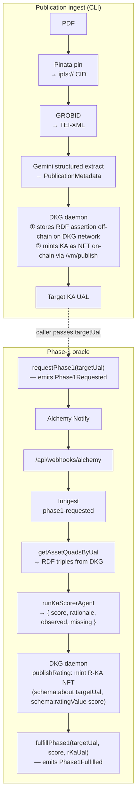
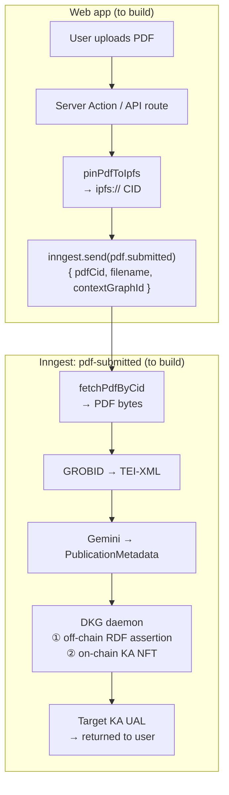
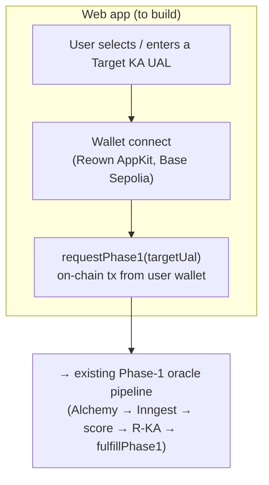

# desci-rating-dapp

A pipeline to mint **Rating Knowledge Assets (R-KAs)** for scientific publications on OriginTrail DKG V10.

Publications are minted as **Target Knowledge Assets (KAs)** via a local DKG daemon. A rating is a **separate** R-KA linked to the target KA via `schema:about` — the original KA is never touched. On-chain, `RatingController` is a request/fulfill state machine: anyone may request, only the oracle agent may fulfill.

**What works today:** publication ingest CLI, R-KA mint, `RatingController` Phase 1 deployed on Base Sepolia, Alchemy webhook → Inngest oracle worker.  
**What does not exist yet:** a user-facing dapp, Phase 2, Phase 3.

---

## The problem

OriginTrail DKG uses a **Dual Engine** architecture: every Knowledge Asset has two complementary representations — its RDF assertion triples are stored off-chain across the DKG peer network (queryable via SPARQL), while a corresponding NFT is minted on-chain (here, Base Sepolia) to anchor ownership and provenance with cryptographic proofs. The on-chain NFT does not contain the data; it is a pointer. This gives KAs cryptographic guarantees and semantic queryability, but no quality signal. Agents traversing the graph to build hypotheses have no way to weight source reliability.

This repo builds the infrastructure to attach a rating to any KA without modifying it: an independent Rating KA minted using the same Dual Engine architecture (RDF triples off-chain on the DKG network, NFT pointer on-chain), linked to the target via `schema:about` and evolving across three phases (machine score → human review → wet-lab).

---

## Current state

| Component | Status |
|---|---|
| DKG V10 daemon HTTP client (`@desci/dkg-client`) | ✅ |
| PDF → GROBID → Gemini → Target KA (CLI) | ✅ |
| R-KA mint + SPARQL query ratings by UAL | ✅ |
| `RatingController` Phase 1 on Base Sepolia | ✅ Deployed |
| Alchemy webhook → Inngest → score → R-KA → `fulfillPhase1` | ✅ (needs public tunnel for Alchemy) |
| Next.js user dapp (wallet, PDF upload, `requestPhase1`) | ❌ |
| Phase 2 — HITL / `ReviewerPool` | ❌ |
| Phase 3 — wet-lab | ❌ |

The Next.js app (`apps/web`) hosts two API routes today: `POST /api/webhooks/alchemy` and `GET|POST|PUT /api/inngest`. The homepage is the default Next.js template.

**Phase-1 scoring** is a Gemini pass (`gemini-3.5-flash-lite`) over the Target KA's RDF triples, producing a structured `{ score, rationale, observed, missing }` verdict. The scoring heuristics are intentionally rough — the goal of this version was to prove the pipeline shape (request → score → R-KA → on-chain fulfill), not to produce a calibrated quality signal.

**Payment model V0:** `requestPhase1` takes no ETH/TRAC. The oracle wallet sponsors DKG publish off-chain.

### Deployed contract (Base Sepolia)

[`0xe83d248193e5cdb0db89ecd113feb1c4d0fe9e96`](https://sepolia.basescan.org/address/0xe83d248193e5cdb0db89ecd113feb1c4d0fe9e96#code)

Alchemy Notify must watch this address. `ORACLE_AGENT` / `ORACLE_AGENT_PRIVATE_KEY` must match `oracleAgent()` on this deploy. The TS ABI and address are generated by `@desci/contracts` — do not hardcode them.

---

## Architecture

### Current: CLI ingest + Phase-1 oracle



### Planned: Web ingest — PDF upload → Target KA (not yet built)



### Planned: Web ingest — Request Phase-1 rating on a KA (not yet built)



The `runPdfToKaAgent` function is already decoupled from file I/O and pinning — callers pin first and pass `{ pdf, pdfCid }`. The CLI does this composition today; an Inngest function should too (GROBID + Gemini + DKG publish can exceed a single HTTP timeout). PDF ingest and rating request are independent flows: a user may publish a KA without immediately requesting a rating, or request a rating on any existing KA UAL.

---

## Repository layout

pnpm workspaces + Turborepo.

```
apps/web                 Next.js — Inngest serve + Alchemy webhook
packages/agents          pdf-to-ka, ka-scorer, IPFS helpers, Inngest/EVM integrations
packages/dkg-client      DKG V10 daemon client + publication/rating KA builders
packages/contracts       Foundry — RatingController.sol + generated TS ABI/address
packages/env             Typed env catalog (@t3-oss/env-core + Zod)
packages/shared          Chain constants + shared types
```

Package-level docs:

- [`packages/dkg-client/README.md`](packages/dkg-client/README.md)
- [`packages/agents/README.md`](packages/agents/README.md)
- [`packages/agents/src/agents/pdf-to-ka/README.md`](packages/agents/src/agents/pdf-to-ka/README.md)
- [`packages/agents/src/agents/ka-scorer/README.md`](packages/agents/src/agents/ka-scorer/README.md)
- [`packages/agents/src/ipfs/README.md`](packages/agents/src/ipfs/README.md)
- [`packages/contracts/README.md`](packages/contracts/README.md)

---

## Prerequisites

- Node.js + `pnpm@10.24.0`
- OriginTrail DKG CLI (`@origintrail-official/dkg` in root devDeps — `pnpm dkg:start`)
- Foundry (`forge`) for contracts
- Docker for GROBID
- Pinata JWT — PDF pin (pin-only; KA stores `ipfs://…`)
- Google Gemini key — `pdf-to-ka` extract + `ka-scorer`
- Base Sepolia RPC + oracle wallet — `fulfillPhase1` and deploy

PDF ingest requires Pinata and Gemini. Phase-1 fulfill hits Base Sepolia. GROBID and the DKG daemon run locally.

---

## Setup

```bash
git clone <this-repo>
cd desci-rating-dapp
pnpm install
cp .env.example .env
# fill in .env — see Environment section
pnpm dkg:init --network testnet   # first-time daemon setup only
pnpm build
```

### Vercel preview (`apps/web`)

Set the Vercel project **Root Directory** to `apps/web` (include files outside that directory for the monorepo). Framework Preset = **Next.js**. Leave **Output Directory** empty (do not set `public`). [`apps/web/vercel.json`](apps/web/vercel.json) installs from the repo root and runs `pnpm turbo run build --filter=web` (dependencies via Turbo `^build`).

If a Preview URL returns Vercel `404 NOT_FOUND` while the deployment is Ready: confirm Framework = Next.js and Output Directory is blank, then Redeploy without cache. Check the deployment **Output** tab for Next routes (`/`, `/_next/...`).

`@desci/contracts` package `build` is `tsc` over committed `ts/` ABI files — Foundry is not on Vercel. After Solidity changes, regenerate with `pnpm contracts:build` (Forge) and commit `packages/contracts/ts/`.

Preview env: at least `NEXT_PUBLIC_REOWN_PROJECT_ID`. Add the preview hostname under Allowed Origins in [Reown Cloud](https://dashboard.reown.com).

---

## Environment

All secrets live in repo-root `.env`. Reference: [`.env.example`](.env.example).

`apps/web/next.config.ts` loads the repo-root `.env` into Next.js automatically — do not create `apps/web/.env.local`.

| Variable | Purpose |
|---|---|
| `DKG_CONTEXT_GRAPH_ID` | Context graph (e.g. `verisci`). Required for the Inngest Phase-1 worker |
| `DKG_API_URL` / `DKG_AUTH_TOKEN` / `DKG_HOME` | Daemon overrides; defaults to `~/.dkg`, port `9200` |
| `DKG_KA_NAME` / `DKG_UAL` / `DKG_SUBJECT_URI` / `DKG_PDF_PATH` | CLI overrides |
| `GROBID_URL` | Default `http://127.0.0.1:8070` |
| `GROBID_TIMEOUT_MS` | Optional; default `120000` |
| `PINATA_JWT` | Required for `pnpm dkg:publish-pdf` |
| `IPFS_GATEWAY_URL` | Optional; defaults to Pinata public gateway (`ipfsGatewayUrl` in `@desci/env`) |
| `GOOGLE_API_KEY` or `GEMINI_API_KEY` | `pdf-to-ka` + `ka-scorer` |
| `GEMINI_MODEL` | Optional; default `gemini-3.5-flash-lite` |
| `BASE_SEPOLIA_RPC_URL` | Deploy + `fulfillPhase1` |
| `PRIVATE_KEY` | Foundry deployer / contract owner |
| `ORACLE_AGENT` | Public address of the oracle, written to `oracleAgent` at deploy |
| `ORACLE_AGENT_PRIVATE_KEY` | Viem signer for `fulfillPhase1` — must match on-chain `oracleAgent()`. Not the deployer key |
| `ETHERSCAN_API_KEY` | `forge script --verify` |
| `ALCHEMY_BASE_SEPOLIA_WH_SK` | HMAC secret for `/api/webhooks/alchemy` |
| `INNGEST_EVENT_KEY` / `INNGEST_SIGNING_KEY` | Cloud Inngest only; not needed for local Dev Server |
| `NEXT_PUBLIC_REOWN_PROJECT_ID` | Reown AppKit (apps/web). Optional — landing builds without it |
| `NEXT_PUBLIC_CONTACT_PORTFOLIO_URL` | Footer portfolio link. Optional |
| `NEXT_PUBLIC_CONTACT_LINKEDIN_URL` | Footer LinkedIn link. Optional |

Never commit `.env`.

---

## Local workflows

### 1 — Sample KA + mock R-KA (no external services)

```bash
pnpm dkg:start
pnpm dkg:publish-sample          # prints a Target KA UAL
# set DKG_UAL and DKG_CONTEXT_GRAPH_ID in .env
pnpm dkg:fetch-asset             # Action A: KA triples  /  Action B: empty (no rating yet)
pnpm dkg:publish-rating          # mock R-KA, score=85, author=BioProtocol_Phase1_Agent
pnpm dkg:fetch-asset             # Action B now shows the rating
```

`publishAssertion` is idempotent — if the named KA already exists its UAL is returned.

### 2 — PDF → publication Target KA

```bash
# Requires: GOOGLE_API_KEY, PINATA_JWT, DKG_CONTEXT_GRAPH_ID
pnpm dkg:start
pnpm grobid:up
# wait: curl -s http://127.0.0.1:8070/api/isalive → true
pnpm dkg:publish-pdf packages/agents/fixtures/asx-pub.pdf
```

Flow: `readFile` → `pinPdfToIpfs` → `runPdfToKaAgent` (GROBID → TEI → Gemini → DKG publish).

GROBID image: `grobid/grobid:0.8.2-crf` (CPU-only). The Compose file uses `network_mode: host` (Linux). On Docker Desktop use `ports: ["8070:8070"]` instead.

Output: a Target KA UAL with `schema:encoding` / `schema:contentUrl` set to `ipfs://…`.

### 3 — Phase-1 oracle

```bash
# Requires: ORACLE_AGENT_PRIVATE_KEY, BASE_SEPOLIA_RPC_URL,
#           DKG_CONTEXT_GRAPH_ID, GOOGLE_API_KEY, ALCHEMY_BASE_SEPOLIA_WH_SK
pnpm dkg:start
pnpm dev            # Next.js on :3000
pnpm inngest:dev    # Inngest Dev Server → http://localhost:3000/api/inngest
```

Alchemy Notify requires a public HTTPS URL. Use `ngrok http 3000` and set the webhook to `https://<host>/api/webhooks/alchemy`. Then call `requestPhase1(targetUal)` on the deployed contract.

The Inngest function retries 3 times with concurrency 5 global / 1 per `requestId`. `fulfillPhase1OnChain` skips silently if the record is already `Phase1Completed`.

**Without Alchemy:** inject `RatingController/phase1.requested` directly from the Inngest Dev Server UI.

---

## Root scripts

| Script | Purpose |
|---|---|
| `pnpm build` / `dev` / `test` / `clean` | Turborepo |
| `pnpm dkg:init` / `dkg:start` / `dkg:stop` | DKG daemon lifecycle |
| `pnpm dkg:publish-sample` | Publish a sample Target KA |
| `pnpm dkg:publish-rating` | Publish a mock R-KA (requires `DKG_UAL`) |
| `pnpm dkg:fetch-asset` | Print KA quads + ratings for a UAL |
| `pnpm dkg:publish-pdf [path]` | Pin → GROBID → Gemini → Target KA |
| `pnpm grobid:up` / `grobid:down` | GROBID Docker sidecar |
| `pnpm inngest:dev` | Inngest Dev Server |
| `pnpm contracts:build` | `forge build` + ABI export + `tsc` |
| `pnpm contracts:test` / `test:vv` / `test:gas` / `coverage` | Foundry |
| `pnpm contracts:deploy:base-sepolia` | Broadcast + verify |

---

## Packages

### `@desci/dkg-client`

`createDkgClient()` connects to the local daemon and exposes: `ensureContextGraph`, `publishAsset`, `getAssetUal`, `publishPublication`, `publishRating`, `getAssetQuadsByUal`, `queryRatingsAbout`, `query`.

Auth and API URL resolve from `createDkgClient({ apiUrl, authToken })` or env / `~/.dkg`: `DKG_AUTH_TOKEN`, `DKG_API_URL`, `~/.dkg/api.port` or `config.json` `apiPort`, `DKG_API_PORT` (default `9200`). `DKG_HOME` overrides the `~/.dkg` directory.

R-KA quads: `schema:about`, `schema:ratingValue`, `schema:author`, `schema:description`. Publication graphs use schema.org + DEO section types. `getAssetQuadsByUal` throws `TargetAssetNotIndexedError` (code `"TargetAssetNotIndexed"`) on empty/404 — the Inngest function retries on this error to handle indexing lag.

### `@desci/agents`

| Export | Role |
|---|---|
| `runPdfToKaAgent` | GROBID + Gemini metadata + `publishPublication` |
| `runKaScorerAgent` | Target KA RDF → `{ score, rationale, observed, missing }` |
| `@desci/agents/ipfs` | `pinPdfToIpfs` / `fetchPdfByCid` |
| `@desci/agents/inngest` | Phase-1 Inngest worker + log-only handlers |

LLM: LangChain `ChatGoogleGenerativeAI` + Zod structured output. No LangGraph.

`ka-scorer` ignores PDF pin metadata (`schema:encoding`, `contentUrl`, `encodingFormat`, `MediaObject`). It rewards author-side `schema:distribution` and methods/materials / RRID evidence only. Named statistical tests are not treated as validated results (MVP heuristic).

### `@desci/contracts`

`RatingController.sol` (Solidity `0.8.24`, `UNLICENSED`).

`RatingRecord` fields: `phase`, `isPending`, `phase1Score`, `phase2Score`, `phase3Score`, `rKaUal`. The `Phase` enum has four values (`Unrated`, `Phase1Completed`, `Phase2Completed`, `Phase3Completed`) but only Phase 1 functions are implemented. `requestId = keccak256(abi.encodePacked(targetUal))`.

`forge build` runs `scripts/export-abi.mjs` which writes `ts/ratingControllerAbi.ts` and `ts/deployments.ts`. If the broadcast file is missing, a fallback address `0x9D53bdabB8Eb1c724323c5542d5C344B2d84B2Cc` is used. Do not edit these files by hand.

### `@desci/env` / `@desci/shared`

`@desci/env`: typed optional env via `@t3-oss/env-core` + `requireEnv` for feature-boundary validation. `@desci/shared`: Base Sepolia chain id and hub address, plus shared types for quads and publish params.

---

## Next steps

### Dapp — Phase 1 in the browser

**Shell (`feat/web-shell`):** VeriSci landing + Reown AppKit on Base Sepolia (`NEXT_PUBLIC_REOWN_PROJECT_ID`). Catalog table, PDF upload, and `requestPhase1` UI still later.

**Wallet:** Reown AppKit on Base Sepolia (chain id `84532`). Use `ratingControllerAbi` + `getRatingControllerAddress(84532)` from `@desci/contracts` for later txs.

**PDF upload → Target KA:** an Inngest function that runs `pinPdfToIpfs` → `fetchPdfByCid` → `runPdfToKaAgent` and returns the UAL. GROBID + Gemini + DKG publish can exceed a single HTTP timeout — an Inngest job is safer. The DKG daemon is local in V0; a public deployment requires a remotely reachable node. Open question: where GROBID runs (Docker sidecar, dedicated service, or remote URL).

**`requestPhase1` from the UI:** connected wallet calls `requestPhase1(targetUal)`; UI polls `getRatingByUal` to show status, score, and R-KA UAL once fulfilled. Open question: who pays the gas (user wallet or server relayer).

Suggested order: (1) AppKit + `getRatingByUal` read-only view, (2) `requestPhase1` from wallet against a CLI-minted UAL, (3) server-side PDF ingest.

---

## Roadmap

### Phase 2 — `requestPhase2` (human review)

Eligible only when `phase == Phase1Completed` and not already pending.

- **`RatingController`**: add `requestPhase2` / `fulfillPhase2`. Fulfill stores `phase2Score`, sets `Phase2Completed`, clears pending, and writes a `wetLabRecommended` boolean that gates Phase 3.
- **`ReviewerPool`** (new contract, owned by `RatingController`): enroll/stake, Chainlink VRF cohort draw, optional disjoint redraw on no consensus.
- **Off-chain**: HITL oracle flow triggered by the Phase-2 request event; oracle calls `fulfillPhase2`. `update()` the existing R-KA UAL (no new NFT).

### Phase 3 — `requestPhase3` (wet-lab)

Eligible only when `phase == Phase2Completed` and `wetLabRecommended == true`.

- **`RatingController`**: add `requestPhase3` / `fulfillPhase3`. Fulfill stores `phase3Score`, sets `Phase3Completed`, clears pending.
- **Off-chain**: wet-lab oracle flow triggered by the Phase-3 request event; oracle calls `fulfillPhase3`. `update()` the same R-KA UAL (no new NFT).

R-KA lifetime: mint once in Phase 1 (`rKaUal` stored on-chain); Phase 2 and 3 `update()` that same asset. No new NFT.

---

## Open questions

- Proxy upgradeability vs immutable `ratings` mapping — V0 ships immutable.
- Composite scoring weights across phases — deliberately unspecified until a labeled dataset exists.
- Citation-triggered re-score via `cito:cites` SPARQL — not in V0.

---

## License

MIT — see `LICENSE`. `RatingController.sol` is `UNLICENSED` in-source.
